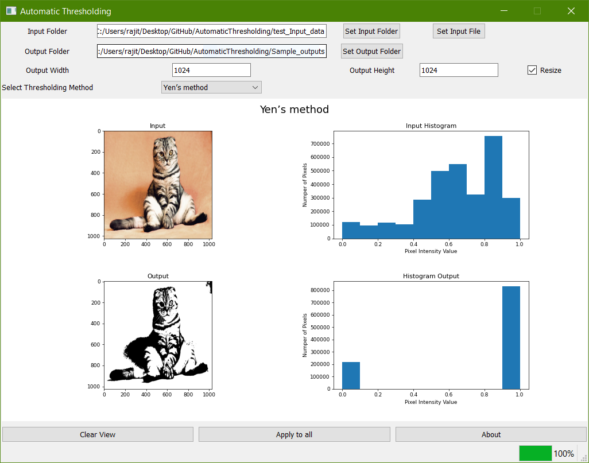

# Automatic_Thresholding

This application can be used to quickly view how different **Thresholding Methods** work on images. Selected threshold method can be applied for bulk images in a folder, results are saved in a user selected folder with histograms.
Supported Thresholding Methods,
1. Yen’s method
2. Triangle algorithm
3. Otsu’s method
4. Minimum method
5. Mean of grayscale values
6. ISODATA method



## Executale can be downloaded from [Automatic_Thresholding](https://drive.google.com/file/d/1-In2zPExB9P4kbyCyba5jiUC8uRcHIk4/view?usp=sharing)

## How to manually create an executable, ?

1. Download and install [Python](https://www.python.org/downloads/)
2. Install  following packages,

**Numpy**,
```
pip install numpy
```
**PySide2**,
```
pip install PySide2
```
**Matplotlib**,
```
pip install matplotlib
```
**scikit-image**,
```
python -m pip install -U scikit-image
```
**PyInstaller**,
```
pip install pyinstaller
```
3. Build .exe from pyinstaller
```
pyinstaller --icon=icon.ico -F --noconsole --onefile AutomaticThresholding.py
```

The executable file can be found in the **dist** folder 


